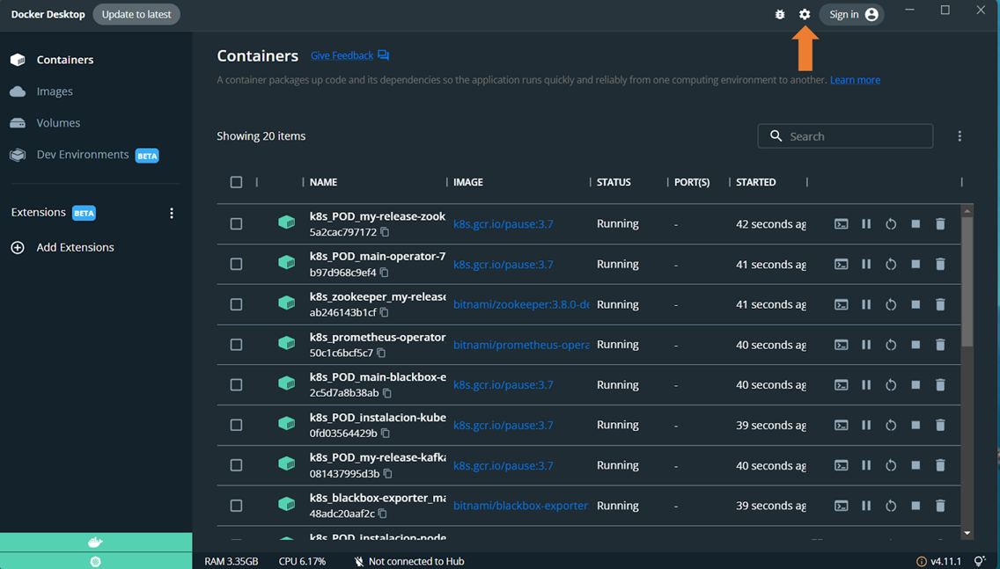
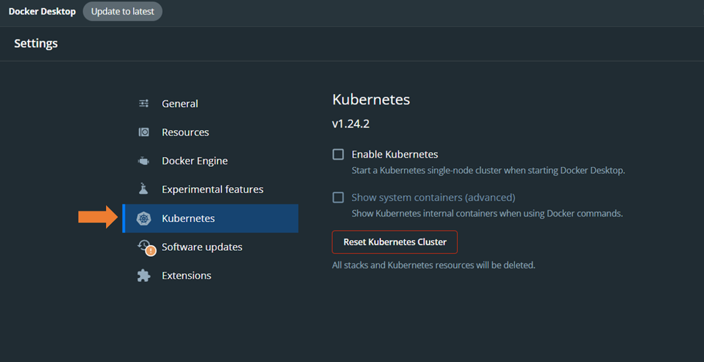
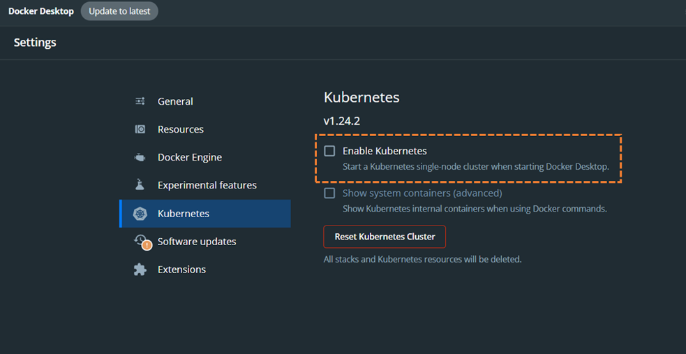
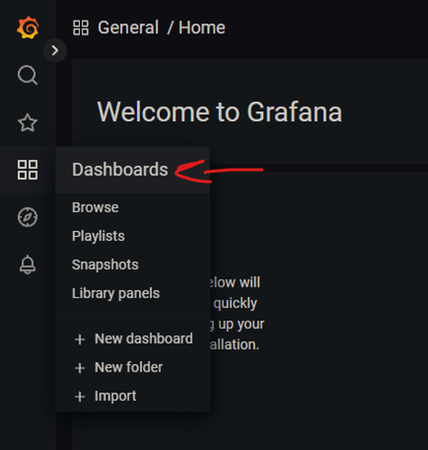
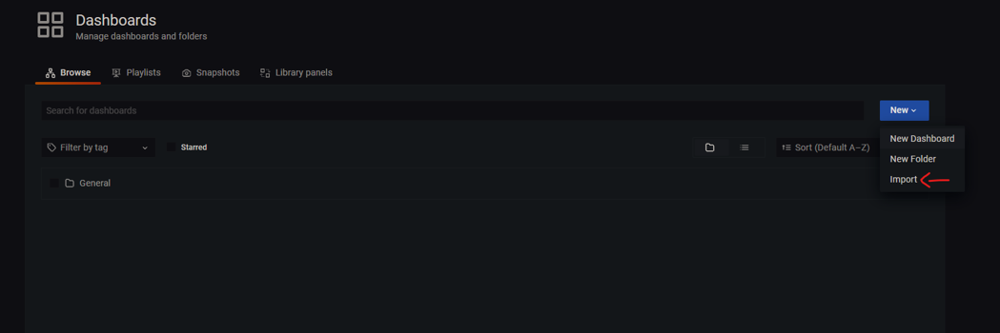
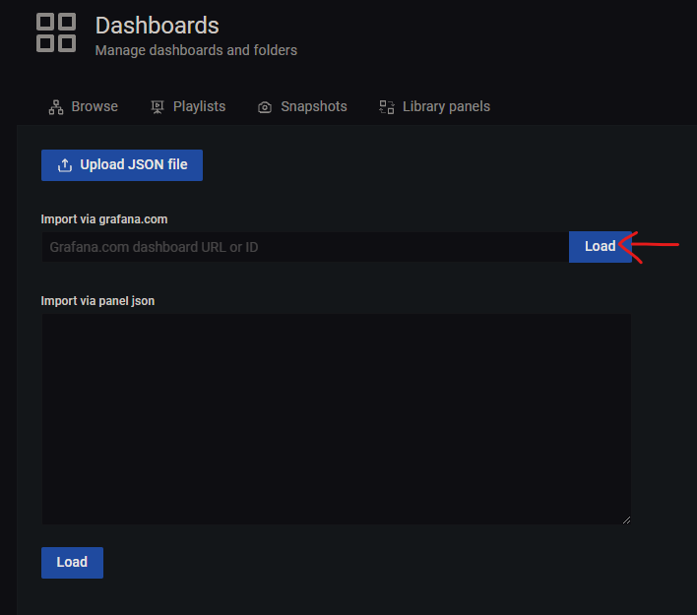
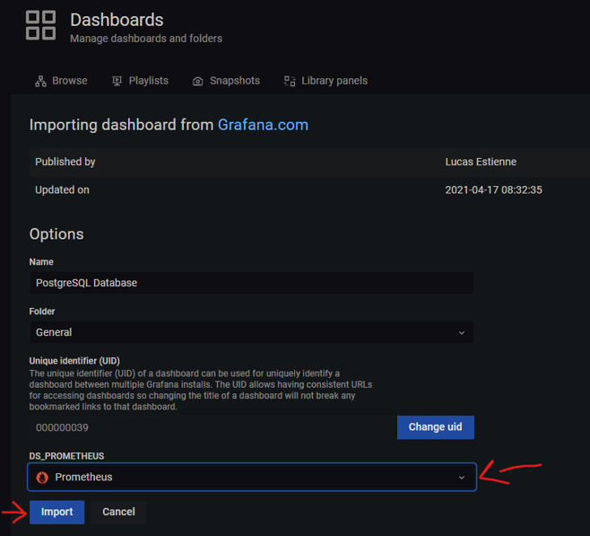

# Instituto Tecnológico de Costa Rica 
> **Base de Datos 2**
> **Tarea Corta I - Observability**  
> **David Achoy - 2020053336**  
> **Andrea Li - 2021028783**  
> **Deyan Sanabria - 2021046131**  
> **Patrick Marchena - 2017239397**  

 <h2> Guía de instalación para la Tarea Corta 1 </h2> 

### Guía de instalación para pre-requisitos

Pre-requisitos para la tarea:
- Tener instalado Docker Desktop.
    - [Guía de instalación para Windows](https://docs.docker.com/desktop/install/windows-install/)
    - [Guía de instalación para Linux](https://docs.docker.com/desktop/install/linux-install/)
    - [Guía de instalación para macOS](https://docs.docker.com/desktop/install/mac-install/)

- Tener instalado Kubernetes en Docker Desktop.  

    - **Paso 1**: Abrir Docker Desktop y abrir Ajustes.

    

    

    - **Paso 2**: Ir a la sección de Kubernetes en ajustes.

    
    
    
    - **Paso 3**: Hacer click en la caja de *Enable Kubernetes*.

    

### Guía de instalación de Helm Chart
Dentro del repositorio, se encuentran dos Helm Chart llamados “databases” y “monitoring”. Primero se necesita instalar el Helm Chart de “monitoring” haciendo lo siguiente:

1. Ubicarse en la carpeta donde se encuentra monitoring.
2. Ejecutar el comando: *helm install `<Nombre de lanzamiento>` monitoring*.
3. Una vez hecho esto, grafana y prometheus quedarian instalados.

Posteriormente se puede instalar “databases”, se debe seguir estrictamente este orden, puesto que se necesita de prometheus para la instalación de los exporters en databases:

1. Ubicarse en la carpeta donde se encuentra databases.
2. Ejecutar el comando: *helm install `<Nombre de lanzamiento>` databases*.
3. Una vez hecho esto, las bases de datos de Elasticsearch, PostgreSQL, MongoDB y MariaDB quedarán instaladas.

### Configuración de Grafana

Grafana viene configurada por defecto incluyendo Prometheus. Si no se especifica un namespace, no hace falta hacer nada más.

Para los dashboards se hace lo siguiente:

- **Paso 1**: Dirigirse a la sección de dashboards

  

- **Paso 2**: Una vez en dashboards ir al apartado de "new" y seleccionar "Import".

- **Paso 3**: Una vez en la ventana de importe, copiar uno de los siguientes códigos:
    - Elastic: 14191
    - PostgreSQL: 9628
    - MariaDB: 13106
    - MongoDB: 7353

- **Paso 4**: Si se necesita seleccionar a prometheus como data source, se hace y posteriormente se presiona el botón de "import".

Una vez hecho eso con todos los dashboards, ya estaría grafana completamente configurada.

### Configuración de las herramientas

Para el chart de monitoring se tienen las siguientes configuraciones:

<blockquote>

    enablePrometheus: true
    enableGrafana: true

</blockquote>

Estos dos valores permiten desactivar prometheus o grafana cambiando el valor por false.

<blockquote>

    kube-prometheus:
        fullnameOverride: "main"

</blockquote>

Esta sería la configuración de prometheus, donde solamente se le sobreescribe el nombre con el objetivo que no cambie por el nombre de lanzamiento que escoja el usuario y se pueda definir de forma automática el datasource en grafana.

<blockquote>

    grafana:
        datasources:
            secretDefinition:
                apiVersion: 1
                datasources:
                - name: Prometheus
                  type: prometheus
                  url: http://main-prometheus:9090/
                  access: proxy
                  isDefault: true
        admin:
            password: "11111111"

</blockquote>

En la configuración de grafana se puede encontrar el datasource automático de prometheus y el password de la cuenta admin queda como 11111111, si el usuario desea, puede cambiar la contraseña desde ahí.

En la parte de monitoring, están las siguientes opciones para desactivar partes de las bases de datos, en el caso de elasticsearch se incluye un condicional para el master node y los data nodes, adicionalmente, se tiene un exporter para elastic que requiere métricas.

<blockquote>

    enableElasticMaster: true
    enableElasticData: true
    enableElasticExporter: true
    enableMongoDb: false
    enablePostgreSql: false
    enableMariaDB: false

</blockquote>

En esta sección se desarrollan los valores del nodo master de elasticsearch:

<blockquote>

    elastic-master:
        nodeGroup: "master"
        replicas: 1
        minimumMasterNodes: -1
        antiAffinity: "soft"
        roles:
            master: "true"
            ingest: "false"
            data: "false"
            remote_cluster_client: "false"
            ml: "false"
        resources:
            requests:
                cpu: "125m"
                memory: "128Mi"
            limits:
                cpu: "1000m"
                memory: "512Mi"

</blockquote>

En este caso, al nodeGroup le colocamos el nombre de “master” para hacer referencia a que es el master node, posteriormente de lo importante se puede destacar que es una replica y los roles asignados solo tiene el de master. Por último, los resources que se encuentran muy limitados por la falta de memoria RAM de las computadoras donde se montaron.

<blockquote>

    elastic-data:
        nodeGroup: "data"
        masterService: "elasticsearch-master"
        replicas: 3
        antiAffinity: "soft"
        roles:
            master: "false"
            ingest: "true"
            data: "true"
            remote_cluster_client: "true"
            ml: "true"
        resources:
            requests:
                cpu: "250m"
                memory: "256Mi"
            limits:
                cpu: "1000m"
                memory: "1024Mi"

</blockquote>

Para los nodos de datos, en nodeGroup le pusimos el nombre de “data” para hacer referencia a su trabajo. Posteriormente, definimos como se llamará el master node y cuántas réplicas queremos. Después, a los roles se les asigna todos los roles excepto el de master, y por último,los recursos un poco más altos que el anterior.

<blockquote>

    prometheus-elasticsearch-exporter:
        serviceMonitor:
            enabled: true
        es:
            uri: http://elasticsearch-master.{{ .Release.Namespace }}:9200
            timeout: 120s

</blockquote>

A diferencia de las demás, para elasticsearch se necesitó poner un exporter como lo decía la especificación, en este caso se activa el servicio de monitoreo, por eso se necesita instalar primero monitoring, porque este servicio se monta sobre los CRDs de prometheus.
La otra parte de la configuración es el URL dentro de kubernetes de donde se van a obtener las métricas de elasticsearch.

<blockquote>

    postgresql:
        primary:
            requests:
                cpu: "1000m"
                memory: "512Mi"
            limits:
                cpu: "1000m"
                memory: "512Mi"
        auth:
            database: "postgresql"
        metrics:
            enabled: true
            serviceMonitor:
                enabled: true

</blockquote>

En postgreSQL, se configuró de manera que se le pudieran limitar los recursos al primary, se habilitaron las métricas y el service monitor de prometheus, debido a la activación de las metricas se tuvo que especificar la base de datos en auth.

<blockquote>

    mongodb:
        resources:
            requests:
                cpu: "1000m"
                memory: "512Mi"
            limits:
                cpu: "1000m"
                memory: "512Mi"
        architecture: replicaset
        replicaCount: 3
        metrics:
            enabled: true
            serviceMonitor:
                enabled: true

</blockquote>

MongoDB tiene más de lo mismo, se especifican los recursos a los que puede acceder cada pod, posteriormente se selecciona la arquitectura en replicaset con 3 réplicas, tal y como se solicitó. Por último, las métricas como se hizo anteriormente con prometheus.

<blockquote>

    mariadb:
        architecture: replication
        primary:
            resources:
                requests:
                    cpu: "1000m"
                    memory: "256Mi"
                limits:
                    cpu: "1000m"
                    memory: "256Mi"
        secondary:  
            replicaCount: 2
            resources:
                requests:
                    cpu: "1000m"
                    memory: "512Mi"
                limits:
                    cpu: "1000m"
                    memory: "512Mi"
        metrics:
            enabled: true
            serviceMonitor:
                enabled: true

</blockquote>

Para mariaDB, se repite el proceso anterior, pero en este caso hay recursos distintos para el nodo primary y secundario, además se especifica que se quieren 2 réplicas secundarias y que la arquitectura va a ser replicación.

 <h3> Conclusiones </h3> 

La tecnología nos permite experimentar lo que se vive día tras día en la industria de la computación, específicamente en el área de bases de datos, y cómo montar de manera correcta la arquitectura de las mismas. Con lo realizado en estee trabajo, se puede experimentar con la creación de diferentes tipos de nodos en diversas bases de datos, tanto SQL como NoSQL. Además, esto impulsa el aprendizaje de la estructuración correcta de las bases a como lo hacen las empresas profesionales.

A su vez, el tema de observabilidad, si bien es cierto que no se logró hacer pruebas de carga; sí se pudieron configurar dashboards para el análisis del comportamiento de bases de datos. Como se nos mostró en clases, esto es muy utilizado en el descubrimiento de carencias que tengan nuestros sistemas y nos permite ver a futuro cómo solucionarlas de forma efectiva.

En general, la experiencia de realizar trabajos como estos se suman al conocimiento que se necesita en la formación como profesionales, y no todos los profesores frecuentan la enseñanza de este tipo de tecnologías a sus estudiantes; se debería incentivar a otros profesores a enseñar cosas como estas.

 <h3> Recomendaciones </h3> 

- La colocación de condicionales para las dependencias de lso Helm Charts son muy útiles para trabajos de esta índole, si bien es cierto que fue sugerida en el enunciado del trabajo, su utilididad es de destacar; pues nos permite desactivar módulos de forma rápida para máquinas con pocos recursos.
  
- La utilización de "alias" de las dependencias de los Helm Charts nos permite instalar una misma dependencia múltiples veces y con configuraciones diferentes.

- Cuando se trabaje con Grafana, puede ser útil configurar una contraseña fija debido a que al desinstalar e instalar Grafana, la contraseña cambia y hay que buscarla en los secrets de Kubernetes; por lo que fijarla hace el trabajo más fluído.

- Revisar la documentación de los Helm Charts que se utilizan es algo a destacar por su gran utilidad a la hora de poder definir la configuración de los mismos.

- Usar los "Built-In Objects" de Helm permite crear configuraciones flexibles a cambio de cosas como el nombre de lanzamiento de algún chart y otras cosas que varían con los cambios que puede aplicar un usuario por fuera, como también lo puede ser definir un namespace.
